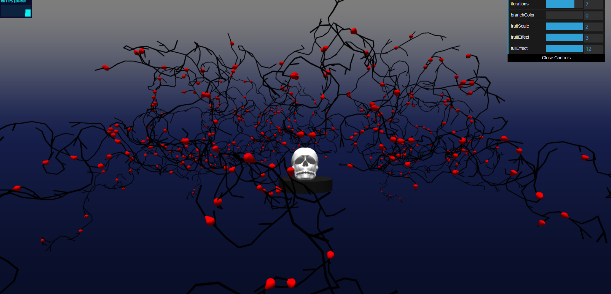
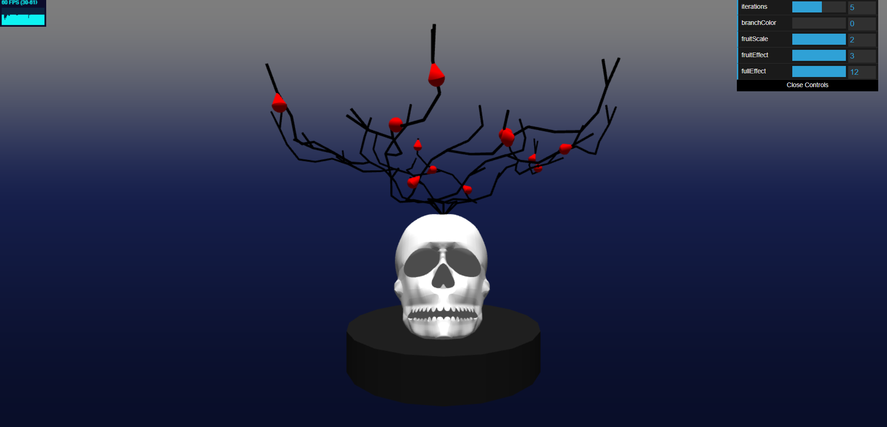
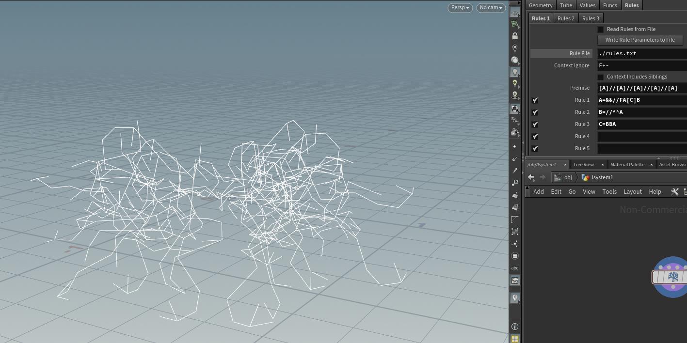

# Ruth Chung

## Pennkey: 33615194

## Link to scene
[https://ruthchu.github.io/hw04-l-systems/](https://ruthchu.github.io/hw04-l-systems/)

In honor of sp00ky season :D

Death's Crown: This (fictional) plant sprouts from the bones of the dead, fueled by the blood and nutrients remaining in the marrow, giving the initial vines a red tinge. This blood is then funneled into fruit that grows on the vine, and as the fruit grows, it leeches the blood from the vines, turning them black. (Toggle the 'fullEffect' slider to view the progression).

 Inspiration taken from creeping vines:

## Sliders/UI elements
iterations
 - Changes how many iterations the axiom is expanded for

branchColor
 - Changes the branch color from black to red

fruitScale
 - Scales the fruit from 0 to 2

fruitEffect
 - Slider that represents the fruit leeching color from the vines. At the threshold of 2, the vines wil be completly black, and at the threshold of 1, the fruit will start to grow.

fullEffect
 - Slider that represents the behavior of this fictional plant. The axiom is expanded for 9 iterations, using red branches only. At the threshold of 9, the vines will begin to turn black, and at the threshold of 10, the fruit will begin to grow.

## Description of rules used to build L-system:
Symbols and Rules:
 - & - pitch down on local axis  by either 44 or 45 degrees
 - ^ - pitch up on local axis by either 10 or 11 degrees
 - / - rotate around local y axis by 45 degrees
 - [ - store turtle's current orientation on stack
 - ] - pop turtle's orientation from stack
 - F - move forward along turtle's local forward axis
 - G - draw a fruit
 - A, B, C - symbols to represent expansion rules

Starting axiom: [A]/[A]/[A]/[A]/[A]/[A]/[A]

Rules for A:
 - &/FA[C]B - This rule is always applied on A. 

Rules for B:
 - /^^A - This rule is always applied on B.

Rules for C:
 - BBA - 80% chance of applying this rule.
 - G - 20% chance of drawing a fruit.

To explain a bit more:
The initial axiom sprouts 7 branches, radiating out at an angle. From these initial 7 branches, the rules dictate that our vines always curl around their local y axis, weaving up and down giving this 'crown' effect.

## Initial visualization in Houdini

## Useful external resources
 - There is no real resource in specific but I googled a lot about quarternions
 - Referenced [https://glmatrix.net/docs/module-quat.html](https://glmatrix.net/docs/module-quat.html) docs a lot
 - Used Houdini to visualise my inital L-System